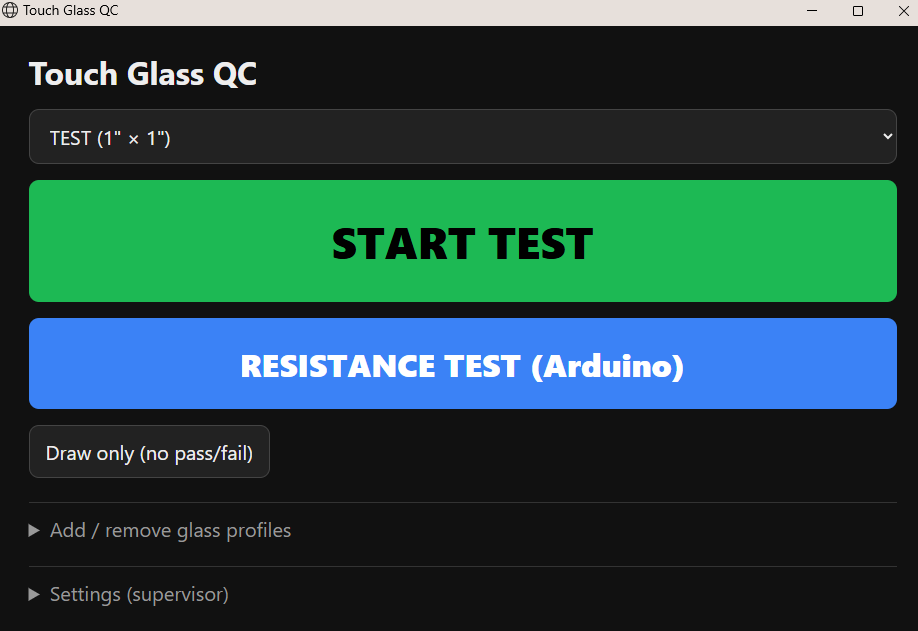
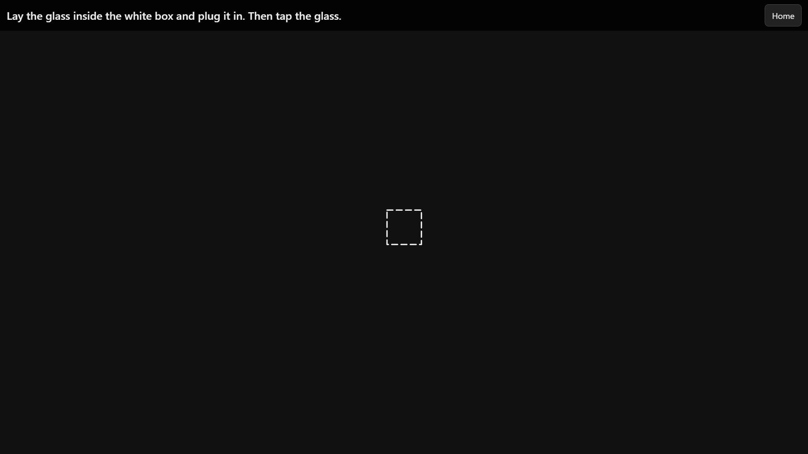
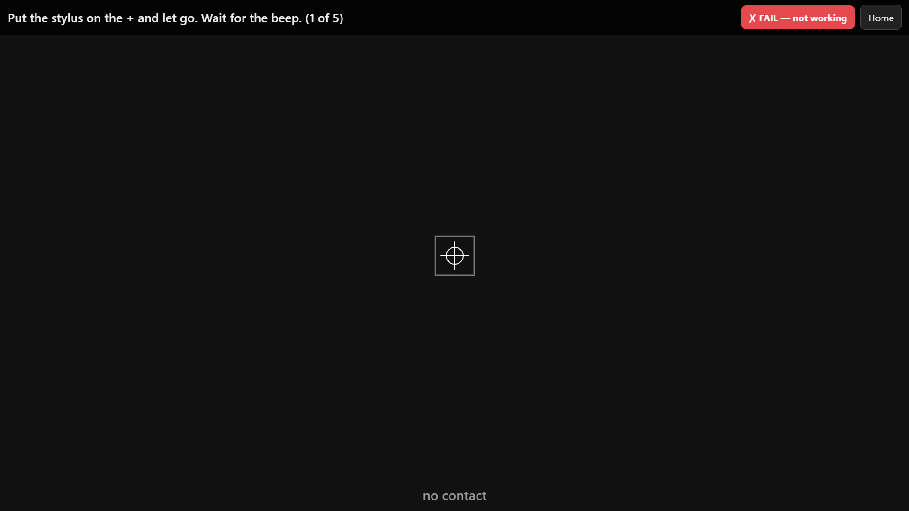

# Touch Glass QC

QC station for 5-wire resistive touch glass. A monitor lies flat and the glass goes on top of it. The screen draws the glass at its true size and walks the operator through the test, step by step, ending in a big **PASS** or **FAIL** with plain-English reasons.

| Home | Place the glass | Resistance test |
|---|---|---|
|  |  |  |

Everything is in one page, `touch-qc.html`. Double-click **`Touch QC.bat`** to open it as its own window (Edge). Chrome works too.

## Two tests

| | Touch test | Resistance test |
|---|---|---|
| Glass plugs into | eGalax USB touch controller | Arduino Nano running `probe/probe.ino` |
| Checks | 4-point calibration, 5-point accuracy + jitter, dead-spot grid, jumps while dragging | wiring/shorts, contact resistance at 5 spots, skips while sliding a stylus |
| Button | **START TEST** | **RESISTANCE TEST (Arduino)** |

Only one controller can be connected to a glass at a time. Both drive the same wires.

## One-time setup

1. **Monitor:** open *Settings*, hold a credit card on the screen, and drag the slider until the blue bar matches the card. Keep browser zoom at 100%.
2. **Profiles:** *Add / remove glass profiles* → name + **active area** width × height in inches. *Backup to file* saves them. Profiles live in the browser.
3. **Touch controller:** Windows 10/11 sees the eGalax as a standard touchscreen, so no driver is needed. If the eGalax driver is installed, leave its calibration at the defaults, because its correction can hide glass faults. With several monitors, map touch to the flat one: *Tablet PC Settings → Setup*.
4. **Arduino Nano:** flash `probe/probe.ino` with the Arduino IDE (board: Nano, processor ATmega328P). Wire the glass's 5 pins to **A0–A4** in any order. The test finds the wiper pin itself. The first run asks you to pick the Nano's COM port.

## Resistance test notes

- 5-wire glass has **no pressure output** on the eGalax (its HID report is X/Y + tip only). The Nano measures the layer-to-layer contact resistance instead: a firm press is about 1 kΩ, and light or partial contact is several kΩ up to open.
- It uses the Nano's internal pull-up (20–50 kΩ) as the reference, so ohms are approximate. Comparing glass against glass on the same Nano is fair. For true ohms, add a 1 kΩ resistor as the reference.
- **Never drive the corners from the pins.** The bottom sheet is only tens of Ω, which is over the pin current limit. The sketch floats all pins after every reading.
- Use a **fixed-weight stylus** (rounded tip plus a known weight) so every glass is pressed the same.
- `probe/live.py` (Linux/WSL, pyserial) is a live readout for experimenting. `probe/host.py` prints the pin connection map.

## Limits

All thresholds are in *Settings*. They are starting guesses: **tune them on known-good and known-bad glass** before trusting a FAIL. The result screen always shows the measured numbers for this.
